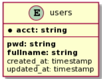

# UI Assignment

## Environment Setup

- Create the git repository and create a new branch: develop.
  - You should also initialize the gradle project.
- (develop)commit 1: Generate the development key pair for 
encrypting/validating JWT.
- (develop)commit 2: Create a new task in build.gradle.
  - Use docker to run a PostgreSQL instance.
    - Database name: ui_test
    - Database user: ui_test
- (develop)commit 3: Create a new task to populate an users table in build.gradle.

## Basic
- Requirements
  - Create a feature branch: feat/impl-api.
  - Use Spring Data REST to build a RESTful service.
  - Use Spring Data JDBC to access the users table.
  - Use JWT as access token for each API, except sign in and sign up.
- AC
  - (feat/impl-api)commit 1: Create an API to list all users.
  - (feat/impl-api)commit 2: Create an API to search an user by fullname.
  - (feat/impl-api)commit 3: Create an API to get the user’s detailed information.
  - (feat/impl-api)commit 4: Create an API to create the user (user sign up).
  - (feat/impl-api)commit 5: Create an API to generate the token to the user (user sign in).
  - (feat/impl-api)commit 6: Create an API to delete the user.
  - (feat/impl-api)commit 7: Create an API to update the user.

## Bonus
- (feat/impl-api)commit 8: Create a query parameter for paging and sorting.
- (feat/impl-api)commit 9: Create an API to update user’s fullname.
- (feat/impl-api)commit 10: Create a swagger document for your APIs.
- (feat/impl-api)commit 11: Use docker-compose to run your application with PostgreSQL.
- (feat/impl-api)commit 12: Create a websocket to push the notification when the user failed to sign in.
  - Create websocket client for testing
- (feat/impl-api)commit 13: Enable security
  - Enable HTTPS
  - CSRF
  - XSS